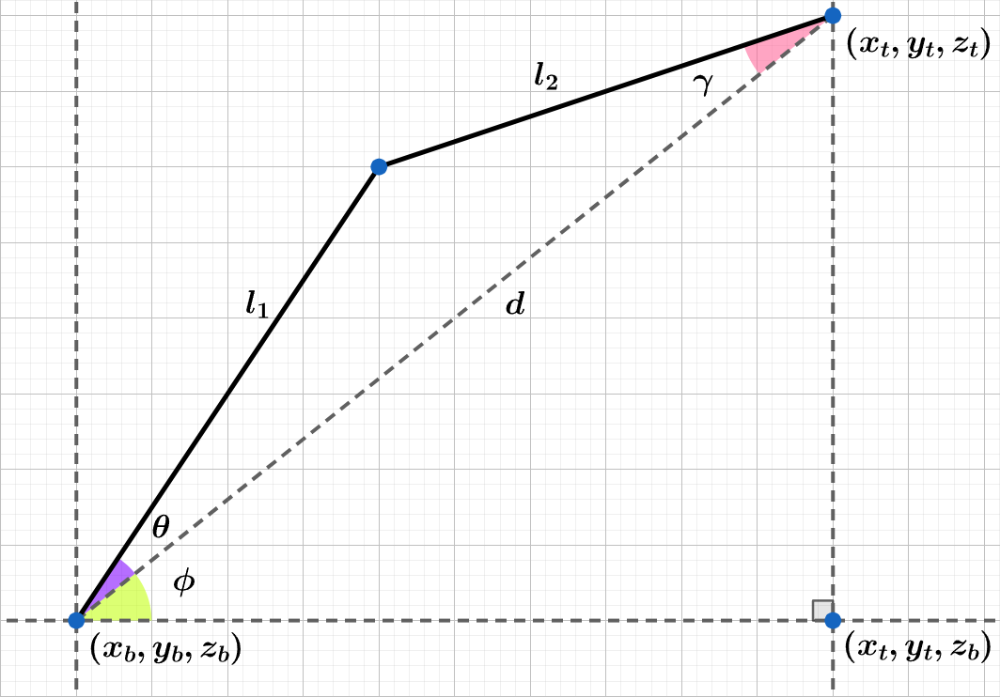
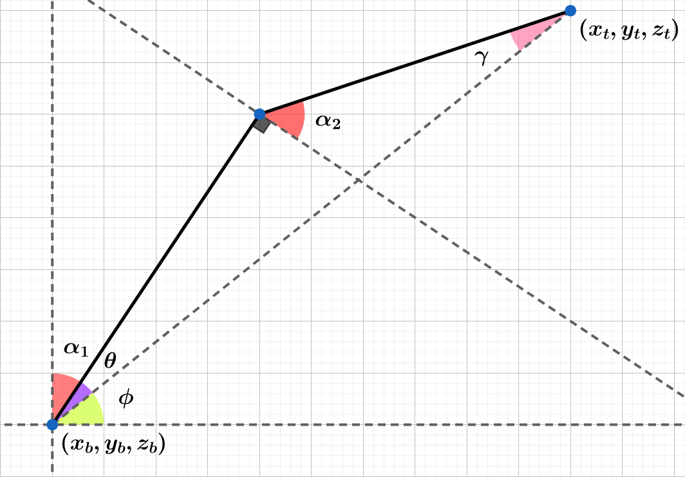
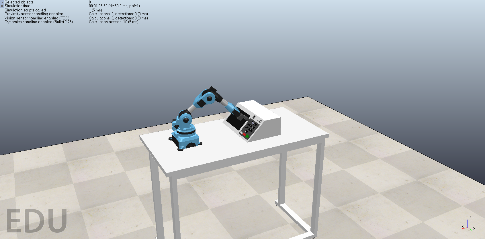

# IF669-Robotica
Projeto extra da cadeira de Introdução à Programação do CIn-UFPE utilizando o simulador de robôs [CoppeliaSim](https://www.coppeliarobotics.com/).

# Objetivo
O projeto consiste em desenvolver um progama na linguagem __C++__ que seja capaz de ler um arquivo de texto, que contém um número arbitrário de votos, e simular uma votação na urna eletrônica com o braço robótico __Niryo One__.

# Funcionamento
* __Conexão com o simulador__
* __Leitura do arquivo de texto__
* __Movimentação do braço__

# Conexão
Para realizar a conexão com o simulador usamos uma [API remota](https://www.coppeliarobotics.com/helpFiles/en/legacyRemoteApiOverview.htm) que já está disponível dentro do próprio CoppeliaSim.

# Leitura
Através dos headers __<stdio.h>__ e __<stdlib.h>__ lemos o arquivo __"votos.txt"__ e armazenamos os votos lidos em um __vetor dinâmico__ de strings.

# Movimentação
Usamos cinemática inversa para determinar uma possível combinação de ângulos de junta que possibilita que a extremidade do braço robótico atinja o ponto $(x_t, y_t, z_t)$. Para determinar o ângulo de junta da base ($\beta$) considere a seguinte visão do plano $xy$:

  

> $$ \tag{1.1} \Large tg(\beta) = \frac{x_t - x_b}{y_t - y_b} \implies \beta = arctg(\frac{x_t - x_b}{y_t - y_b}) $$

Seja $\pi$ o plano que é perdependicular ao plano $xy$ e contém os pontos $(x_t, y_t, z_t)$ e $(x_t, y_t, z_t)$. Sejam $\phi$, $\theta$ e $\gamma$ ângulos auxiliares que ajudaram na determinação dos ângulos de junta restantes ($\alpha_1$ e $\alpha_2$), considere a seguinte visão do plano $\pi$:

  

> $$ \tag{1.2} \Large tg(\phi) = \frac{z_t - z_b}{\sqrt{(x_t - x_b)^2 + (y_t - y_b})^2} \implies \phi = arctg(\frac{z_t - z_b}{\sqrt{(x_t - x_b)^2 + (y_t - y_b})^2}) $$

> $$ \tag{1.3} \Large (l_2)^2 = d^2 + (l_1)^2 - 2dl_1cos(\theta) \implies \theta = arccos(\frac{d^2 + (l_1)^2 - (l_2)^2}{2dl_1}) $$

> $$ \tag{1.4} \Large (l_1)^2 = d^2 + (l_2)^2 - 2dl_2cos(\gamma) \implies \gamma = arccos(\frac{d^2 + (l_2)^2 - (l_1)^2}{2dl_2}) $$
 
Por fim, para determinar $\alpha_1$ e $\alpha_2$, considere esta última visão do plano $\pi$:
 

  

> $$ \tag{1.5} \Large \alpha_1 + \theta + \phi = \frac{\pi}{2} \implies \alpha_1 = \frac{\pi}{2} - (\theta + \phi) $$

> $$ \tag{1.6} \Large (\frac{\pi}{2} + \alpha_2) + \theta + \gamma = \pi \implies \alpha_2 = \frac{\pi}{2} - (\theta + \gamma) $$

# Imagens

  

  

  

